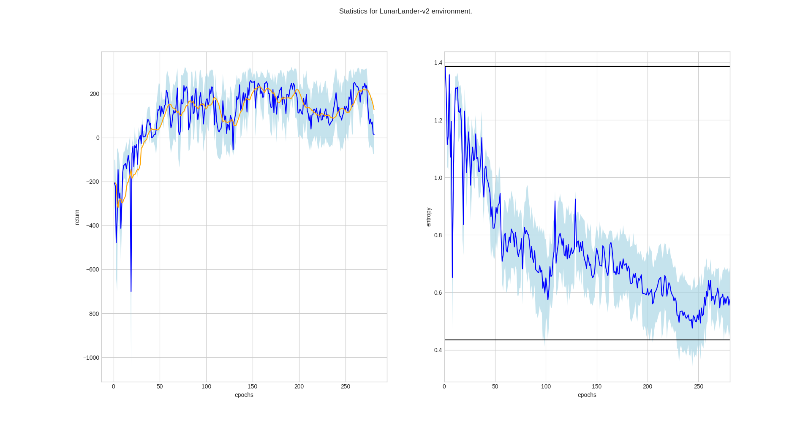
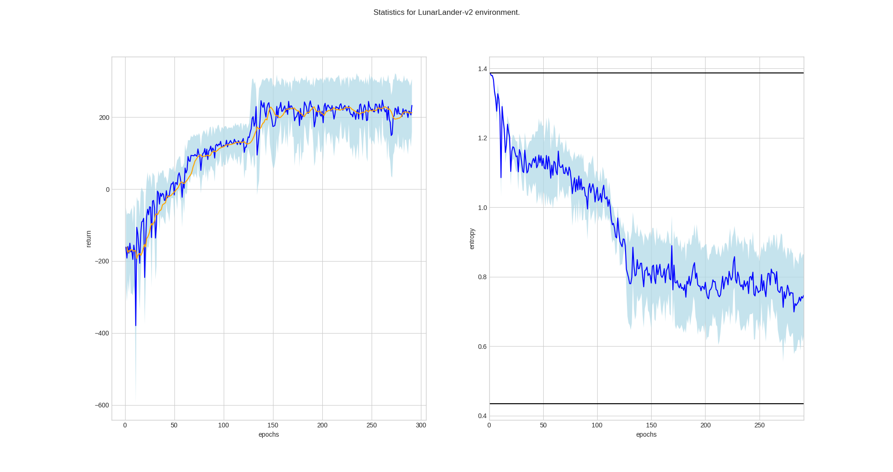

# Reinforcement learning: Policy gradients algorithms

This repository contains Python implementations of policy gradient algorithms
used in deep reinforcement learning. Repository is a result of my "Master's Project"
course.

## Results

### Vanilla policy gradient
#### CartPole-v0

The following figures show results for two runs of vanilla policy gradient algorithm.

#### LunarLander-v2

### Off-policy VPG with importance sampling

- TODO

### Cross entropy

- TODO
  
## Resources

### Papers:

1. A Natural Policy Gradient - [Paper](https://papers.nips.cc/paper/2073-a-natural-policy-gradient.pdf)
2. Trust Region Policy Optimization - [Paper](https://arxiv.org/pdf/1502.05477.pdf)
3. Proximal Policy Optimization Algorithms - [Paper](https://arxiv.org/pdf/1707.06347.pdf)
4. Implementation matters in Deep Policy Gradients: A Case Study on PPO and TRPO - [Paper](https://arxiv.org/pdf/2005.12729.pdf) | [OpenReview](https://openreview.net/forum?id=r1etN1rtPB)

### Courses, lectures and bootcamps:

1. Deep Reinforcement Learning and Control, CMU - [2018](http://www.andrew.cmu.edu/course/10-703/) | [2019](http://www.andrew.cmu.edu/course/10-403/) | [2020](https://cmudeeprl.github.io/703website/)
2. Deep RL Bootcamp, Berkeley, 2017. - [Site](https://sites.google.com/view/deep-rl-bootcamp/lectures)
3. Deep Reinforcement Learning, UC Berkeley, CS285 - [Site](http://rail.eecs.berkeley.edu/deeprlcourse/)
4. Deep Reinforcement Learning, Stanford, CS234 - [Site](http://web.stanford.edu/class/cs234/index.html) 

### Other:

1. [Natural Gradient | Manu Joseph](https://towardsdatascience.com/natural-gradient-ce454b3dcdfa)
2. [Natural Policy Gradient Explained | Jonathan Hui](https://medium.com/@jonathan_hui/rl-natural-policy-gradient-actor-critic-using-kronecker-factored-trust-region-acktr-58f3798a4a93)
3. [A intuitive explanation of natural gradient descent | Kevin Fran](http://kvfrans.com/a-intuitive-explanation-of-natural-gradient-descent/)